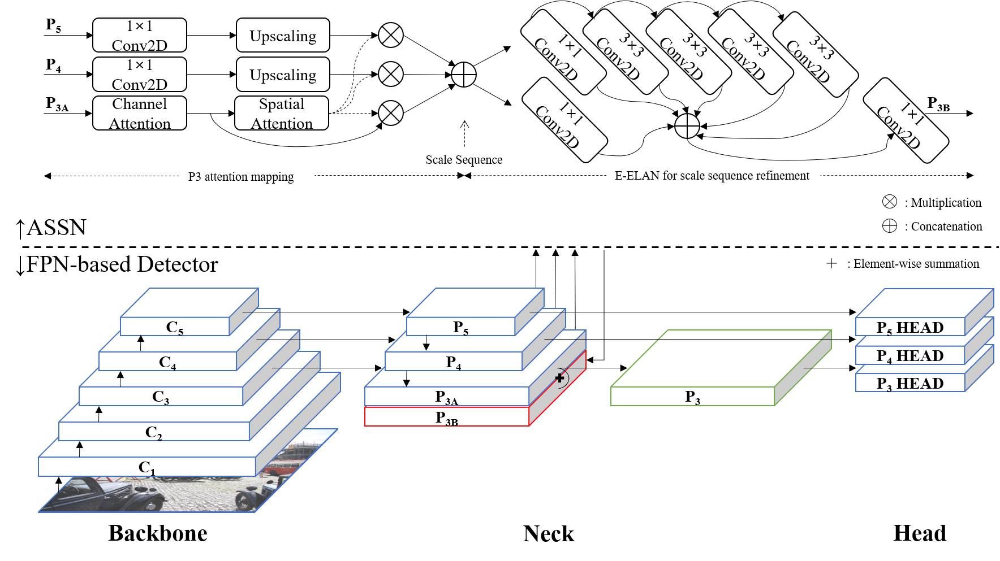
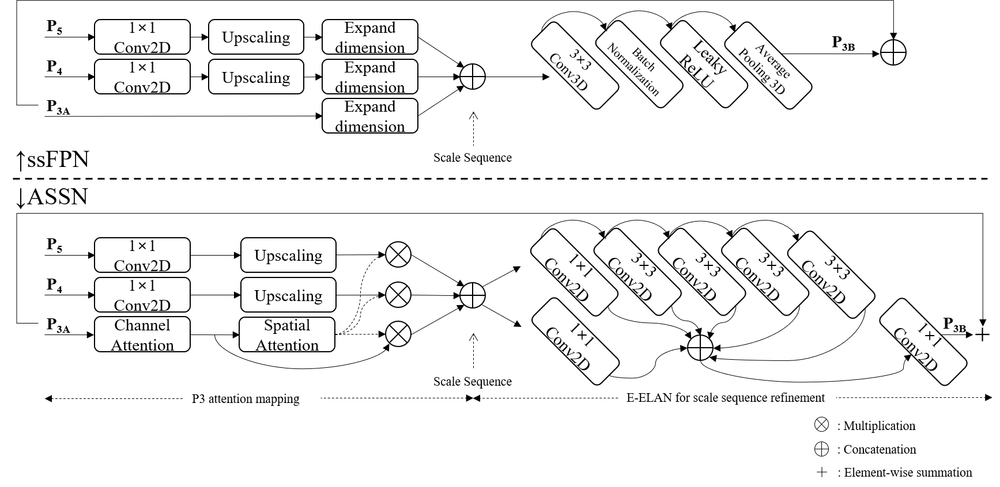

# E-SSFPN: Enhanced Scale Sequence feature-based Feature Pyramid Network

This repository contains the research results of E-SSFPN, which improved the performance of YOLOv7 based on [SSFPN](https://github.com/smu-ivpl/ssFPN), a previous study conducted on YOLOv4 and YOLOR.

## E-SSFPN Architecture

## Comparison between SSFPN and E-SSFPN

***
